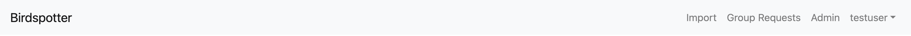
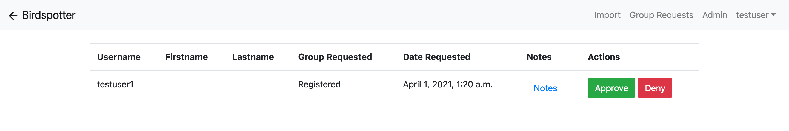
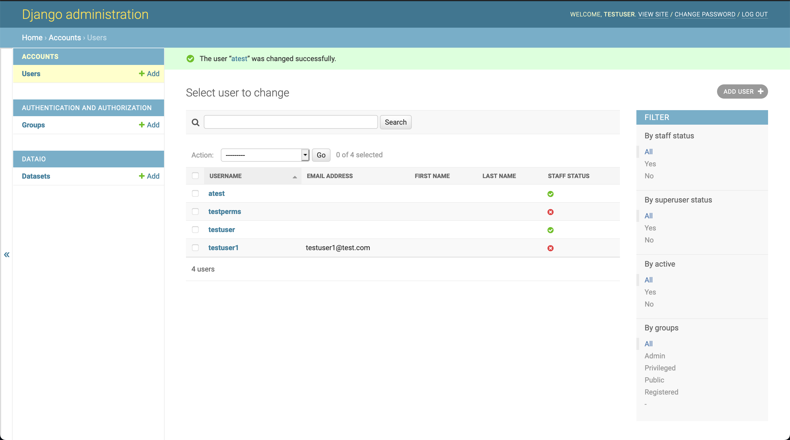
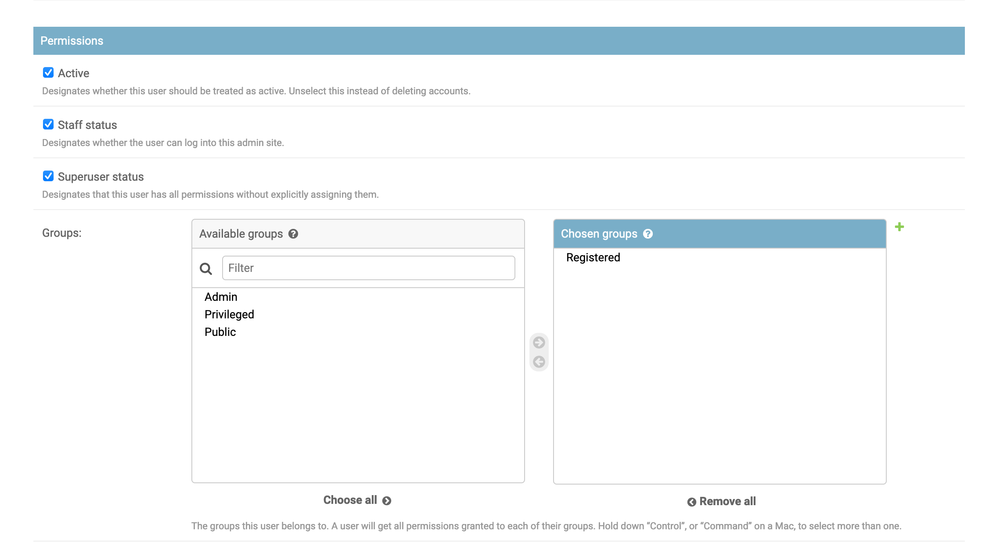

***************************************
Administrative Procedures
***************************************

Installation
================
-----------------
Required Software
-----------------
Docker is required to run the application. For instructions on how to install docker, please visit https://docs.docker.com/get-docker/

.. note:: Some installations such as linux will not include docker-compose and will require additional steps for installation. https://docs.docker.com/compose/install/

-------------
The .env file
-------------
In order for the application to run correctly, the .env file must be filled out correctly. An example file is located at ``docker-compose/.env.example``. This file must be named ``.env``.

- **SECRET_KEY**: The secret key for the application. This should be generated via ``python3 -c "import secrets; print(secrets.token_urlsafe())"``
- **DEBUG**: should be set to false for production enviroments, though can be useful for troubleshooting.
- **DBUSERNAME/DBPASSWORD**: Username and password used by the application (when not run using docker, the application defaults to a sqlite3 database).
- **POSTGRES_USER/POSTGRES_PASSWORD**: Admin/root user and password that can be used to connect to the production database if you need to perform priveleged tasks on the database.
- **EMAIL_(HOST, PORT, HOST_USER, HOST_PASSWORD, USE_TLS, TIMEOUT)**: Email server configuration options.
- **ALLOWED_HOSTS**: List of allowed host/domain names to be served by the application.
- **DOMAIN**: The applications FQDN.
- **DJANGO_SUPERUSER_(PASSWORD, USERNAME, EMAIL)**: Credentials for the application's superuser, this user will be responsible for allowing initial users into the system.

These variables can be left at their default values.

- **PROD_EMAIL**: Whether the application will use a normal mail server to send mail. Setting to false will not send emails and will instead print the email to the application logs (Default ``true``).
- **USE_X_FOWARDED_HOSTS**: Flag to enable USE_X_FORWARDED_HOST on the server (Default ``true``).
- **PROD_FS**: Whether the application will use the production file system (Default ``true``).

------------------------
Starting the application
------------------------
1. In order to start the application in production more, while in the docker-compose directory, run ``docker-compose -f docker-compose.yml -f docker-compose.prod.yml up``.

.. note:: To run the application in detached mode (the application is not attached to the bash session) run docker-compose up with the detach flag (``-d``)

2. Run ``./initial_setup.sh`` to initialize the stack.
3. Restart the stack by running ``docker-compose restart birdspotter``
4. To stop the application, if you are in the docker-compose directory, you can run ``docker-compose down``.
   
- If you are running in the attached mode, i.e. logs are being displayed in the terminal window, stopping the stack can be done with CTRL-C

.. note:: In order to view logs while the application is running in detached mode, run ``docker-compose logs -f``

Routine Tasks
================

-------------
User Accounts
-------------
Once there is a set of admins within the system, user administration will come in two forms.

.. _navbar:

    : Admin user navbar

First off, requests for elevated group permissions and access to the aplication (going from a public user to registered user) will be handled in the Group Requests page. An admin simply has to press "Approve" or "Deny" depending on the decision and the decision will be stored and the request removed from the list.

.. _group_requests:

    : Group requests view

The other location for user administration will be within the admin page itself. Like the Group Requests page, there will be an option in the navbar for any admin user that will take them to the Django admin panel. From there, click on Users, and then actions such as creating a user, changing a user's account to inactive, or deleting the user can be performed.

.. _admin_page:

    : Main admin page

.. _user_admin:

    : User admin controls

------------------
Django admin panel
------------------

In addition to performing administration actions on user accounts, the admin panel allows the user to view, edit, and delete any object related to the application.

Backups
================

----------------
Backing up
----------------
There are only two parts of the system that store data long-term and therefore need backups - the database, and the mass storage.

The database backup procedure is fairly standard for PostgresQL databases, albeit within Docker: 

``docker-compose exec postgres pg_dump -h localhost -U postgres birdspotter > db_backup.sql``

This backup should be encrypted (perhaps via zip using ``zip -e "birdspotter-$(date +"%Y-%m-%d").zip" db_backup.sql``), or some other means, and stored on another machine, or within your existing backup solution.

.. warning:: Ideally, the database backup process should be performed automatically, perhaps as part of a CRON job.

The mass storage solution chosen to run alongside this application should itself already have a backup and redundancy system of some sort - perhaps it is a hosted file storage system, with routine incremental backups, or running in high-availability to prevent data loss. 

---------------------
Restoring from backup
---------------------

Restoring the database from backup involves starting up only the database in docker-compose with ``docker-compose -f docker-compose.yml -f docker-compose.prod.yml``
and then feeding the unencrypted backup into the database with ``docker-compose exec postgres psql -h localhost -U postgres birdspotter < db_backup.sql``.

Restoring the mass storage from backup is very dependent on the exact type and setup of your mass storage system, but you must ensure the newly-restored files are present in the file directory when the Django application is started.

User Support
================
