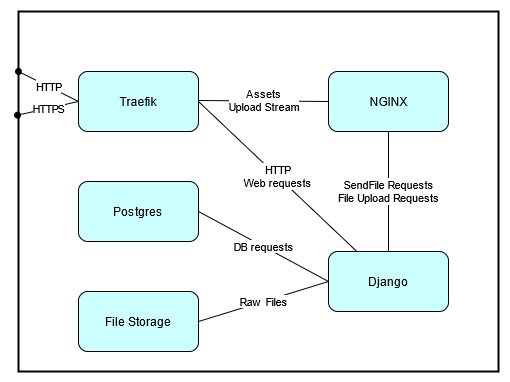

***************************************
System Overview
***************************************

Background
================
The system is composed of five major components: the Django python application, Postres, NGINX, Traefik, and a mass storage system, as can be seen in :numref:`systemoverview` .

.. _systemoverview:

   : A system diagram depicting the relationships between the various parts of the system.

The Django application is the core of the system, while the Postgres database contains all of the application data except for the raw files.
The Django application offloads file uploads and downloads to the NGINX server, while the Traefik proxy handles traffic routing and HTTPS termination. 
The Traefik proxy can also handle automatic certificate renewal via LetsEncrypt if necessary.
Finally, the mass storage handles the storage of all the raw files (Original Shapefiles, GeoTiffs, thumbnails).

Hardware and Software requirements
=====================================