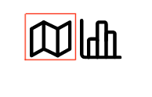

***************************************
Instructions
***************************************

Home View
==============================

This is the home page of the birdspotter app, and is where you can navigate the datasets that you have access to.

.. _home_view:
.. figure:: static/home_view.png
   :alt: "Example of the home view"
   :align: center

   : Example of the home view
   
Navigating to a Data View
##########################################

.. note:: Public (Unregistered) users do not have access to the Data View, as it contains information not otherwise available to them.

1a. To navigate to the map view, click on the left icon under the "view column" of the dataset's row

.. _map_view_highlight:

   
   : Selection for map view
   
1b. To navigate to the data view, click on the right icon under the "view column"

.. _data_view_highlight:
.. figure:: static/data_view_highlight.png
   :alt: "Selection for data view"
   :align: center
   
   : Selection for data view
   
2. To navigate back, click on the back arrow or birdspotter logo

Actions: Modify Dataset Metadata
##############################

.. note:: This action is only available for datasets you have ownership permissions for.

1. Select the "Actions" dropdown in the chosen dataset's row

2. Select "Edit Dataset"

3. Change the metadata to match what you would like to be displayed 

Actions: Queue Analysis of a Dataset
#################################################

.. warning::  Not yet implemented
.. note:: This action is only available for datasets you have ownership permissions for.

1. Select the "Actions" dropdown in the chosen dataset's row

2. Select “Queue Analysis”

3. Select the algorithm to queue

Actions: Export Dataset
####################################

.. warning::  Not yet implemented
.. note:: This action is only available for datasets you have permission to export.

1. Select the "Actions" dropdown in the chosen dataset's row

2. Select "Export"

Actions: Export Dataset
####################################

.. warning::  Not yet implemented

1. Select the "Actions" dropdown in the chosen dataset's row

2. Select "Export"

Data View
==============================

This View allows registered users to view the data of their own and publically available datasets.
The data is arranged into the form of charts and tables.

.. _data_view:

   : The data view as it may appear to a Registered User

Map View
==============================

This view allows the user to view a dataset overlaid on a map. Public users only have access to the
average location and number of data points, while registered users have access to each individual data point,
and all of the corresponding data.

.. _map_view:
.. figure:: static/map_view.png
   :alt: "Example Map view for Registered User"
   :align: center

   : The map view as it may appear to a Registered User

Importing Files
==============================
This function allows you to import .tif and .zip files.

.. tip:: Make sure to upload the entire zip file containing the entire shapefile, such the .shp, .shx, and other files.

Procedures
##############################
Follow the steps below to import a file.

1. Click on the import button in the top right of the app.

2. Click on the browse button and locate the file you wish to upload.

3. OPTIONAL: Tick the "Make dataset public" checkbox if you wish to make the dataset public to other users.

4. Click the "submit" button to upload the file. 

.. warning:: * Uploading a file that is not a .zip or .tif will result in an error. 
             * .shp and .shx files in a .zip with missing fields may lead to errors.

Account Management
==============================

Creating an account
##############################

1. Click the "Login" dropdown in the top right of the app.

2. Click on the "Request Access" option

3. Fill in the required forms and click "Register"

Logging in
##############################
1. Click the "Login" dropdown in the top right of the app.

2. Enter your credentials

3. Click "Login" 

Editing account details
##############################

1. While logged in, click on your username dropdown in the top right of the app.

2. Click on the "Profile" button

3. Edit the account details and save via the "Submit" button

Resetting Password
##############################

1. Click the "Login" dropdown in the top right of the app.

.. tip:: If you are logged in, you can change your password via the "Profile" button in the dropdown

2. Click on the "Forgot Password" link

3. Enter your email for the password reset and click "Reset Password"