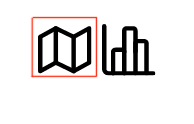

**************************
Public User Instructions
**************************

Home View
==============================

This is the home page of the birdspotter app, Public Users are allowed to see the map view of the public datasets.

Dataset Selection
#################

1. Click on the box of the dataset that you would like to look at

2. To navigate to the map view, click on the left icon under the "view column"

.. _map_view_highlight:
