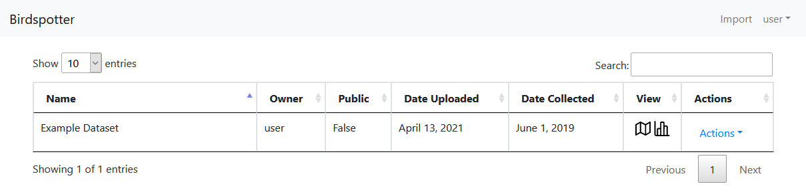

**************************
Public User Instructions
**************************

If you do not have an account, this section contains all of the information regarding account creation and using the app.
If you do have an account, see the "Instructions" section of the manual.

Home View
==============================

This is the home page of the Birdspotter app. Public users are allowed to see the map view of the public datasets.

.. _public_home_view:

   : Example of the home view

Dataset Selection
#################

1. Click on the box of the dataset that you would like to look at.

2. To navigate to the map view, click on the left icon under the "View" column.

.. _public_map_view_highlight:
.. figure:: static/map_view_highlight.png
   :alt: "Selection for map view"
   :align: center
   
Creating an Account
###################

1. Click on the "Login" button in the top right of the page.

2. Select "Request Access" and fill in the form.

3. Click "Register".

Map View
========

Here is where you can view some cursory information about a given dataset. 
Unregistered users do not have access to much of the data of a given dataset, but can see the population and general
location of the data points.